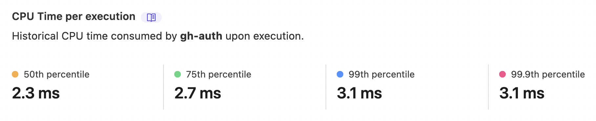

# Gatsby + Cloudflare Workers + Rust

A simple implementation for GitHub OAuth2 authentication using [Cloudflare Workers](https://workers.cloudflare.com) and Rust.

It's _blazingly_ fast and there's _no cold-start overhead_.

[demo](https://gatsby-cloudflare-rs.pages.dev/)

## Setup

1. Make an OAuth2 application on GitHub.
2. Deploy the frontend without environment variables.
3. Deploy the workers.
4. Add the API URL to the frontend's environment variable, `GATSBY_GITHUB_API`, and rebuild it.

## References

- [GitHub login OAuth flow with AWS Lambda](https://www.ivarprudnikov.com/github-oauth-login-aws-lambda/)
- https://github.com/cloudflare/workers-rs
